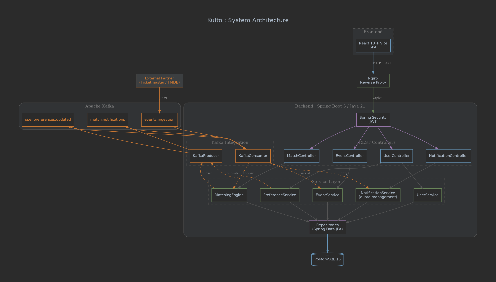
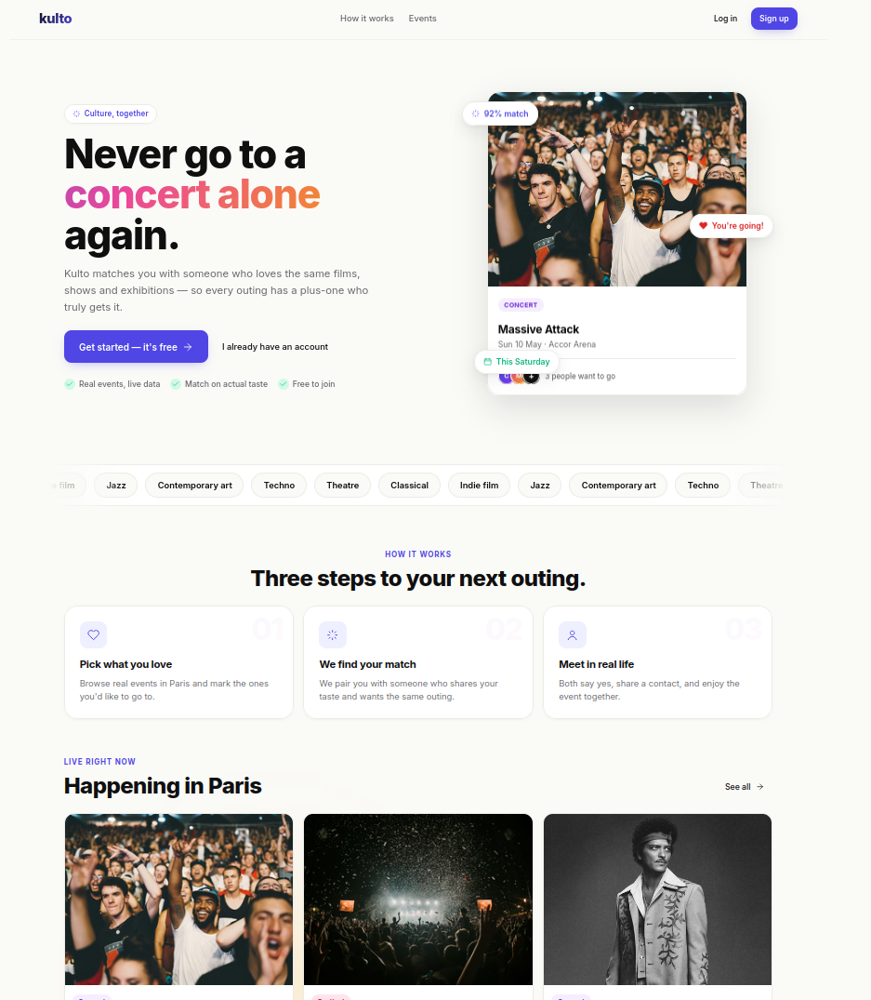
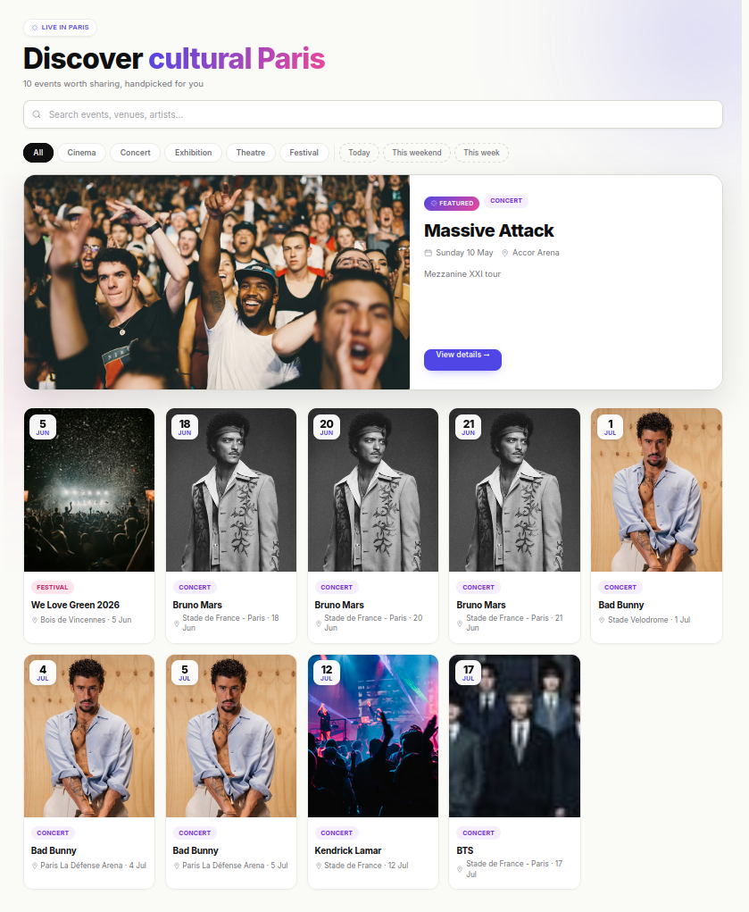
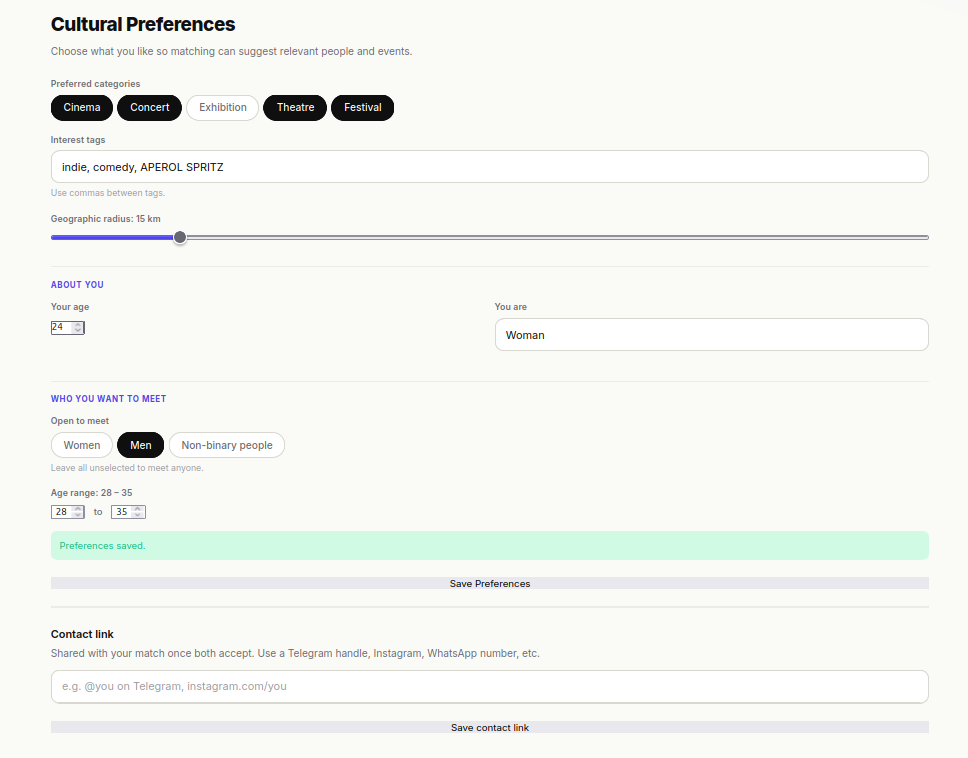
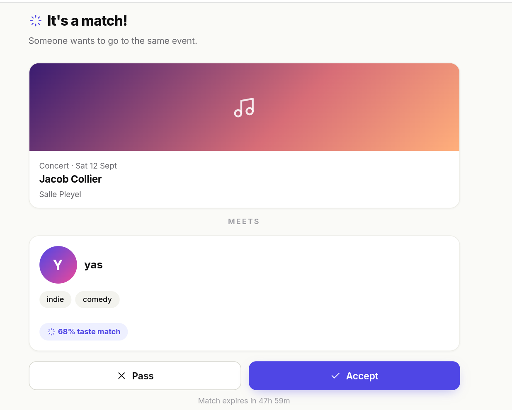

# Kulto

Kulto is a cultural matching platform. Users set their cultural preferences (film genres, music taste, interest in theatre or exhibitions) and get matched with people who share their taste around real-world events happening near them. We thought of it as a "Tinder for cultural outings", minus the romance angle.

The project features a modular monolith backend with event-driven processing via Kafka, a React frontend, and a containerized deployment pipeline.

## Group Members

- Maria KHVATOVA
- Samy LAYAIDA
- Yasmine BENALI
- Baptiste Cormorant

## Tech Stack

| Layer | Stack |
|-------|-------|
| Frontend | React 18, Vite |
| Backend | Java 21, Spring Boot 3 |
| Messaging | Apache Kafka |
| Database | PostgreSQL 16 |
| Infrastructure | Docker, docker-compose, GitHub Actions |
| Security | Spring Security, JWT |

## Architecture Overview

The system is a modular monolith with event-driven async processing via Kafka. The backend exposes a REST API consumed by the React SPA. External partners publish cultural events into Kafka, which are ingested and persisted automatically. A matching engine processes user preferences asynchronously and delivers capped daily match notifications.

| Module | Responsibility |
|--------|----------------|
| Event Service | CRUD for cultural events, ingestion from Kafka |
| User Service | Registration, authentication (JWT), profile management |
| Preference Service | Cultural preference management, triggers matching via Kafka |
| Matching Engine | Compares user tags, finds compatible events, produces match candidates |
| Notification Service | Enforces daily quota, delivers match notifications |



## Documentation

- [Conception & Architecture Document](./docs/conception.md) (MVP scope)
- [Sprint Planning & Roadmap](./docs/sprint-planning.md)
- [User Stories & Backlog](./docs/user-stories.md)
- [Architecture Diagram](./docs/img/kulto-architecture.png)
- [Kafka Flow Sequences](./docs/img/kulto-kafka-flows.png)
- [Data Model](./docs/img/kulto-data-model.png)
- [Architecture Decision Records (ADRs)](./docs/adr/)

## Screenshots

### Landing page
The public entry point of the app — hero, live event preview card with "X people want to go" signal, marquee of cultural tags, and the three-step explainer.



### Discover — event feed
Gradient heading, unified search + category filters, a featured event card and a responsive grid of upcoming outings with date badges.



### Cultural Preferences
Users pick categories and interest tags, then set demographics (**About you**: age & gender) and matching filters (**Who you want to meet**: preferred genders + age range). These feed the matching engine.



### It's a match!
When two users both mark "I want to go" on the same event and are mutually compatible, a match is created with a taste-match score and a 48h acceptance window.



## Getting Started

```bash
# Clone the repo
git clone git@github.com:<org>/kulto.git
cd kulto

# Start the full stack
docker-compose up -d

# Backend:   http://localhost:8080
# Frontend:  http://localhost:3000
# Swagger:   http://localhost:8080/swagger-ui.html
# Kafka:     localhost:9092
# PostgreSQL: localhost:5432
```

## Testing

### Frontend E2E (Cypress)

The frontend uses [Cypress](https://www.cypress.io/) for end-to-end tests. Tests are located in `frontend/cypress/e2e/`.

All API calls are intercepted with `cy.intercept`, so no backend is needed to run the suite.

**Prerequisite:** the Vite dev server must be running on `http://127.0.0.1:3000`.

```bash
cd frontend
npm run dev          # start dev server (keep this running)
```

Then in a second terminal:

```bash
cd frontend
npm run cy:run       # headless (CI-friendly)
npm run cy:open      # interactive Cypress UI
```

`npm run test:e2e` is an alias for `cy:run`.

---

## CI/CD

The GitHub Actions pipeline runs on every push/PR to `develop` and `main`:

1. Maven build + test
2. JaCoCo coverage report (threshold: 70%)
3. Docker image build
4. Push to GitHub Container Registry
